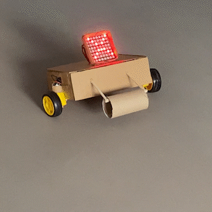

# MIDTERM PROJECT: Robot with Emotion!

## SUMMARY
My first official robot was made with the focus of exhibiting emotion. I wanted to prioritize making the construction sturdy and keep the cable management clean and easy to follow, so I took the more simple route. This makes use of:

- 1 Neopixel
- 2 DC Motors
- 1 H-Bridge
- 1 External Power Supply

## INSTRUCTIONS
Using the colored buttons, press each to exhibit a different emotion and see the robot move: green for stoic, yellow for happy, blue for sad, red for angry.

## STRUGGLES
I had many struggles with this project. The first one was the connection between the two radios, which I realized early on was due to me flipping my radio's wires. 
After this, I struggled with getting my emotion animations to quickly transition with each button, which Jack taught me was due to the delay() function. I then stuck to using milis() and it worked perfectly.
After beginning to stick everything inside the box, what stopped me once more was the DC motors, which were too weak to support the heavy hardware inside. I ended up placing a tissue roll to the front, as well as gluing the motors to the wheels and adding cardboard strips as well.

## PERFORMANCE
Here are closeups of all the emotions:

And what the robot looks like when stopping, showing the use of the toilet paper roll.

## FINAL DEMO
Here is the demo of the final project: click the picture to be redirected to the video!

