# JOURNAL
**Shortcuts: [Day 1](journal.md#day-1-october-1), [Day 2](journal.md#day-2-october-3), [Day 3](journal.md#day-3-october-5), [Day 4](journal.md#day-4-october-6), [Day 5](journal.md#day-5-october-7), [Day 6](journal.md#day-6-october-11) [FINAL DEMO](journal.md#final-demo)**

## DAY 1: October 1

Starting off this project, I first created a sketch of what I want the robot to look like: I want it to use a Neopixel to show emotion, as well as evoke a different speed depending on its mood (fast for happy, back and forth for angry, etc.)

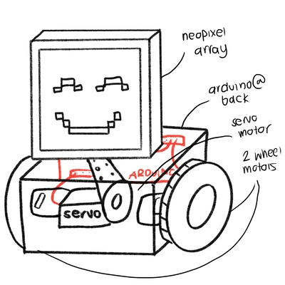

During this time, my two Arduinos still weren't communicating well with each other. With this said, I decided to first work on the expression of the robot, which I thought would work best with the Neopixel. I began drawing a grid to determine which pixels I have to turn on.

I created four emotion animations:

STOIC:

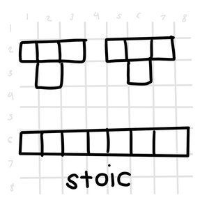

HAPPY:

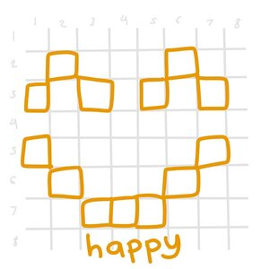

SAD:

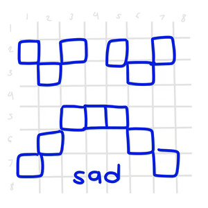
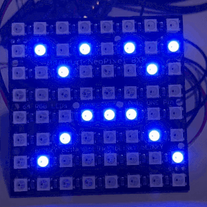

ANGRY:

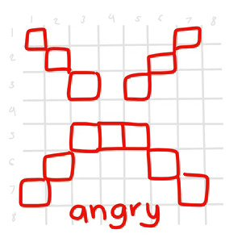

## DAY 2: October 3

Finishing all of my work in my other classes, I had the whole day today to work on what I was doing wrong with my second radio. It would still heat up when I tried to run the code. So, I went to the IM Lab to get advice and realized that *MY WIRING WAS COMPLETELY BACKWARDS!*

Attached is what I did, and what I was supposed to do. After finally rewiring it properly, I finally got it to work.

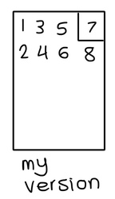
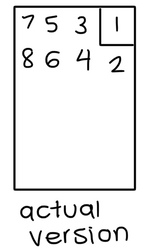

With now being able to clean my wires, I changed the buttons to the bigger ones from my Intro to IM kit and moved all the wires to the right so my finger won't get caught.

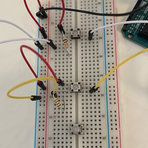
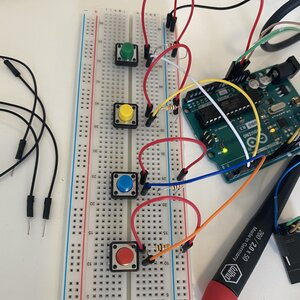

Taking what I learned in Professor's class, I added the Transmitter and Receiver class so each button will show a different emotion with the button. However, the reaction is very slow: as you can see, it stays stoic even when I press the happy button repeatedly.

## DAY 3: October 5

Today, I wanted to get to the bottom of why the delays of the emotion animations were so late after the button is pressed. However, before doing this, I created a small box for the neopixel that would serve as the "head" of the robot. I was happy with how sturdy I made it: usually my box making skills aren't that good.

Now to tackle the delayed response in the animation. Testing a few things, I noticed that my motors acted immediately after the button is pressed, and only when the neopixel animations are added do they become delayed as well.

After discussing this with Jack, he said that it was most likely due to the delay function in the neopixel animation. Together, we came up with a code that would make use of millis() instead. This is something I already tried, but I thought the method of adding it would be different as we are using bytes rather than numbers.

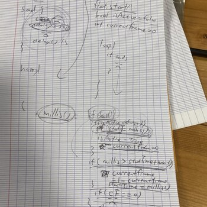

After using this code, the animations finally worked quickly! I was very happy with how it turned out. However, one thing I am still confused about is why the radio is giving a signal of 2 even when I'm not pressing anything. This makes the neopixel stuck on the "stoic" animation and intersect with other animations if I press it for less than a second.

## DAY 4: October 6

I was able to fix the emotions mixing by just adding the strip.clear() function after each animation! After I got everything fixed, it was time to do my most dreaded part: putting everything inside the box and managing the cables. Hardware was never my strongest suit, so I decided to go as slowly as possible, which seemed to benefit me!

My cable management was super neat (if I do say so myself) and I even made slots for certain things like the battery to avoid it from moving inside the robot.

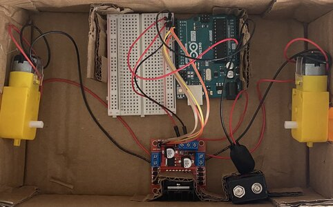
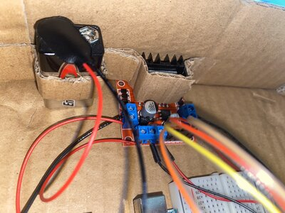

After I got everything nice and snug inside the box, I decided it was time to make the robot work without a cable. Using the battery and the button, I was able to get it to work: I was so happy when I succeeded, I took a picture with my new robot! :D

Getting the robot to move was a big problem. I didn't take into account how heavy and big the box would be: as a result, the wheels would either fall off or not work at all. This was most likely because I put the motors inside the robot and only left the small legs outside to connect with the wheels.

I tried my best to use carboard to connect the motors to the box, but it was just too weak. To check if the wheels still worked, I had to put it on top of a toilet paper roll so the box won't rely on the wheels for its weight.

I ended up sleeping at 2AM because I couldn't find a solution.

## DAY 5: October 7

On the 4th day, I decided to try get the two motors to support the box. It wasn't moving because the wheels were too close to the box, causing them to get caught and not move. I got so desperate that I even tried attaching chopsticks to the bottom that would distance the wheels away from the box (what I mean below):

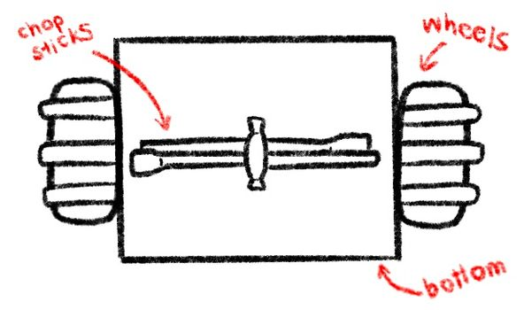

When it came to a last resort, I decided to glue the two DC motors to the side of the box. I wanted to avoid doing this because I was afraid that they would malfunction, but thankfully this did not happen.

After getting the two motors to stabilize, what I noticed is that the robot was still sitting akwardly, as if it's weight was not balanced. As a solution, I used the two chopsticks from before and rolls of toilet paper to stabilize the robot from the front, so it wouldn't fall when the robot stops in the Stoic animation.

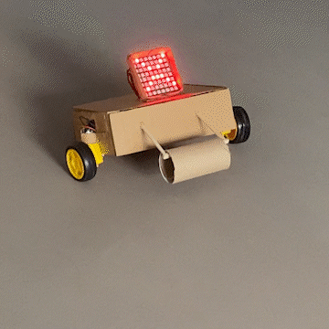
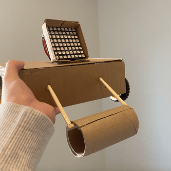

Another thing that was a quick fix was that I noticed the robot veered more to the left, which I noticed was because I used two different kinds of wheels from the kit: one was rounder than the other. I just switched one for the other and it fixed it up pretty well!

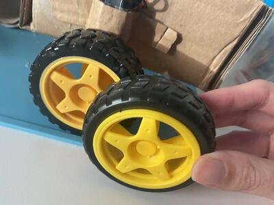

## DAY 6: October 11

I was a bit confused as to why my motors weren't working, and why only the Angry animation was working. After looking closer at my code, I noticed that the analogWrite for the angry emotion was a digitalWrite, which means it was because of the code. Now everything wasn't working. Here was my old command:

    analogWrite(motor1pin1, 100);
    digitalWrite(motor1pin2, LOW);
    analogWrite(motor2pin1, 100);
    digitalWrite(motor2pin2, LOW);

After looking more at Professor's advice, I realized that I mistook which were the PWM Pins (where you put the speed) I spent the next few minutes trying to determine which is the PWM pin and the digital pin, as those still confused me. This is what it should be:
    
    digitalWrite(motor1pin1, LOW);
    analogWrite(motor1pin2, 170);
    analogWrite(motor2pin1, 170);
    digitalWrite(motor2pin2, LOW);
    
 After fixing this, I spent a few times revising the code to fit the minimum speed the DC motors faced. Because I wanted the Sad animation to have slow wheels, I realized this wasn't possible. As a solution, I made different sequences for each emotion instead of making them just all go forward.

## FINAL DEMO

Finally, my project was finished! Attached below is the thumbnail, click on it to be sent to the video:

