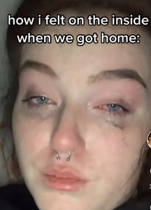

# On Stage: Robots as Performers

I found the concept of the inner monologue to be quite interesting, and if this would even be possible to implement in a robot. As mentioned in my presentation of Sayonara, some play reviewers found it to be quite robotic as the actor would constantly have to time themselves perfectly to the robot's prerecorded audios. This is because they lack this awareness and cue that we humans have, where we recite the line that deems the most fit when being told a certain line of dialogue. If such an inner monologue is implemented in robots too, I couldn't see how different they would now be to human actors.

I believe that this reading proves how the realms of theater and music are dire to helping us understand how to coexist with robots, and what solutions would make that transition easier than it is right now. Over the years, we have focused too much on making them look like us, leading to phenomenons such as the uncanny valley and people being "triggered" over AI influencers, saying that yes they look like us, but there is no soul behind the face and body.

Take Siri or Wall-E. Both these forms of technology have no physical features that resemble a human. But we are able to empathize with them due to their response to humans and their tone that evokes emotion. With introducing concepts of inner monologue and responsiveness, we are realizing that the key to coexistence is not the physicalities, but what is inside that hollow tin chest.

# My Own Robot Play

I believe that robots can definitely help us tackle difficult conversations. We as humans are deeply complex beings, and our psyche prevents us from being able to better understand topics that seem simple, an example being interracial relationships (and the parental discouragement of it). If such an issue is tackled between two humans, the issue becomes more difficult to discuss, due to our long history of race.

However, replacing one of the partners with a robot, and suddenly this becomes a simple conversation. *A human cannot date a robot, they're both completely different! One's upbringing is the opposite of the other. If I was the parent of the human, I don't know how I would feel.* We begin to understand ourselves in the perspective of robot struggles. This could be dire in not only forming empathy for robotic relations, but give us a deeper understanding of the self when introduced to the Other.

Something that I would like to tackle in my play is the concept of parental disappointment, maybe due to their child not being as "perfect" as they sought them out to be, whether mentally, physically, or even in terms of gender. This is an extremely taboo topic, but apparently is very common amongst new parents (from all the TikToks I watch about "gender disappointment"). Many tend to shame the parents, but do not understand their struggle. 

With this topic, I would try to create a play based off of a robot dog that has been newly adopted into a couple. Set in the future where adoption is a lottery process, they wanted to get a real, fluffy dog, but were disappointed that the adoption agency gave them a robotic replica. The robot dog is happy that it is part of a new family: he runs, wags his tail, and requires all the things a normal dog does. However, we never see the couple warm up to him. A couple of days pass and the couple decides to get a real dog, treating him with love and warmth. They begin to disregard the robot dog, who is seen trying to ask for pets and for food from his owners. As the months pass, we see how his head droops low in sorrow, asking himself what he did wrong. Slowly, he whimpers as he settles on his pillow and powers down forever.

With the protagonoist not only being a robot but also a dog, it allows multiple interpretations of a play but all comes down into the one message of unacceptance and the concept of the Other once more.

