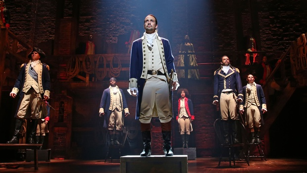
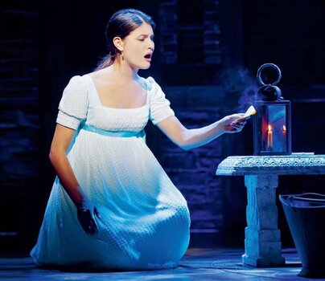
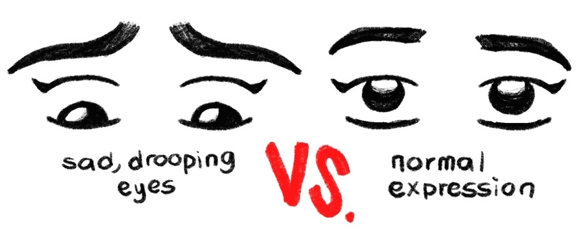
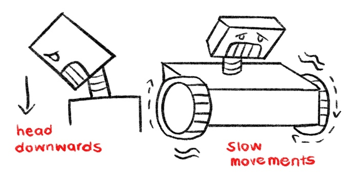

# Character Robot Recreation

## PLAY & CHARACTER CHOICE
The play I would choose to base my robot from is from the popular Broadway play Hamilton, which talks about the life of America's founding father Alexander Hamilton. This was my favorite play when I was in high school, and my favorite character was Elizabeth Schuyler, Hamilton's wife.

The scene I would choose is when Eliza finds out that Alexander had cheated on her, where she performs a song while burning his letters. It is such a raw performance of sorrow and betrayal, that I would love to see how this would turn out in a robot, where such emotions have to be programmed first.

## MAKING THE ROBOT

### Technical Features
Drooping eyes, eyebrows furrowed in frustration and sadness

### Dressing

### Actions
Pointing her head down in sorrow
Slow moving

