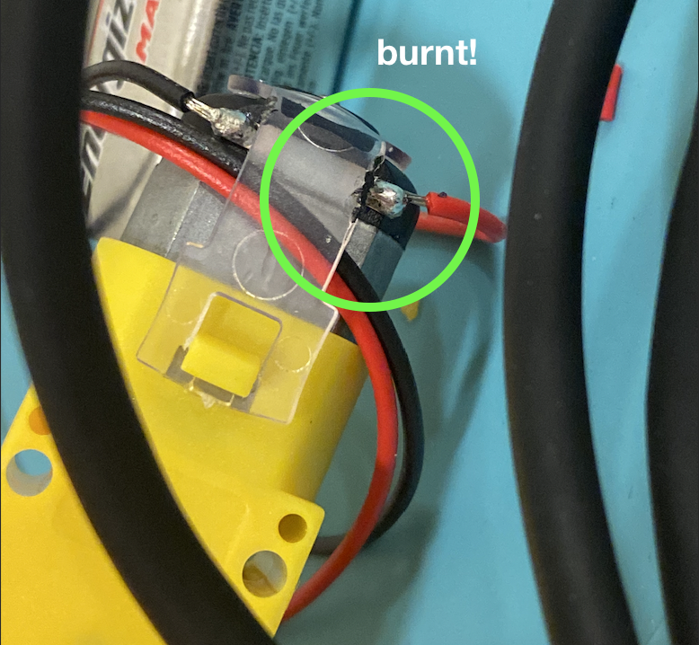
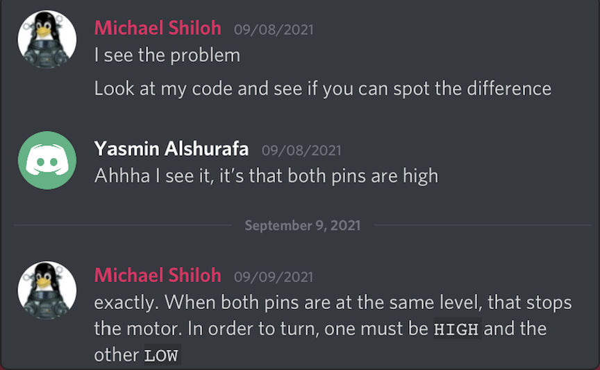

# PERFORMING ROBOTS ASSIGNMENT 1: Soldering & Moving Motors

Our assignment for this week required us to solder wires into the motors provided to us, and making them move at the push of a button. Though we all had the same process, I had my own personal setbacks that I had to solve.

## PROCESS

The first thing I did was solder a second motor. Because I wanted it to be exactly like the first one I made in class, I ended up cutting two sets of wires because I thought the first ones weren't long enough. Because this was still new to me, I ended up getting the solder too close to the plastic part of the motor. I was scared that it wouldn't work because of this, but thankfully it did.

After, I went to check if my first motor still worked. Because I didn't disconnect any of the wires from class, all I had to do was connect it to my laptop. However, it wasn't working. I scrambled my brain thinking of a solution: I disconnected all wires, tested the motor on the battery, and even changed the battery-wire connector. Nothing was working.

However, when disconnecting the 4 wires from the IN pins, it seemed that, when I disconnected the wire in the IN4 Pin, it worked. *This is impossible,* I told myself. Is this some sort of glitch? (Click the gif to be sent to the video.)

However, when I looked at Discord, I saw that Yasmin had the exact same problem, and Professor pointed out a problem I also had: both my IN3 and IN4 pins were on HIGH, keeping the motor still. Through changing one of them to low, it finally got to work.

Lastly was adding the button. Luckily I still remembered a bit from Intro to IM, so I was able to include it with no problem.

## FINAL PRODUCT

My simple "robot" is here. Click the picture to be sent to the link:

