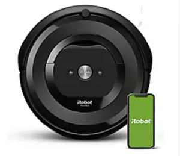
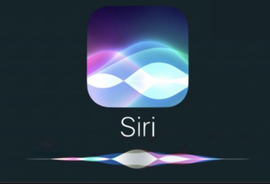
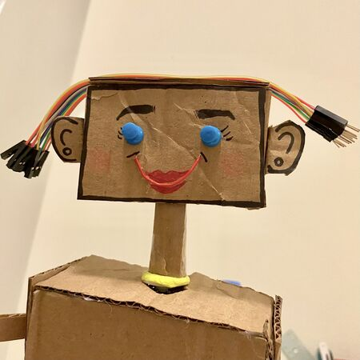
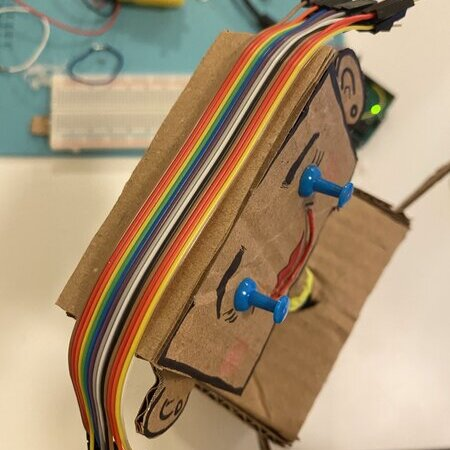
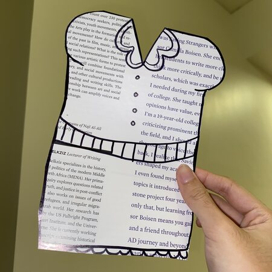

# ASSIGNMENT 2: OUR FIRST ROBOT
My first robot is a sequence using two servo motors attached to a cardboard humanoid robot, making its head turn to the side (as if scanning if there are people around) and wave to its audience. This was very exciting since its the first robot I've created, and it makes me motivated to make more complex ones in the future.

Here are some shortcuts: [Prebuild Question](README.md#prebuild-question-what-is-a-robot), [Worries](README.md#1-worries-for-the-project), [Initial Process](README.md#2-initial-process), [Hardships and Complexity](README.md#hardships), [Final Demo & Story](README.md#final)

## PREBUILD QUESTION: WHAT IS A ROBOT?

For me, a robot is any autonomous object that can perform a certain function without the need of a human force. For example, I wouldn't call a regular vacuum cleaner a robot because yes, it has the function of cleaning, but with the help of human effort. However, a Roomba on the other hand, would be a robot. In addition, this definition is not limited to physical objects, but digital ones as well. Siri's purpose, for example, is to help users through answering questions and navigating the phone on her own.

## 1. WORRIES FOR THE PROJECT

From the beginning of this assignment, I knew I wanted to create a humanoid robot. At the start, I didn't know if I was able to use things that we did not tackle in class, and we were only limited to the motors and wheels. I had trouble with this, because I didn't know how to create a clean robot and hide the wires, or even make it work without having to plug it into Arduino. However, after learning that I could use the servo motors, I went with those instead. 

##### process
## 2. INITIAL PROCESS

I first began by creating the head of the robot, which was a simple rectangle with a thing in the middle for more structure and stability.

Seeing how the servo motors move, I knew I wanted to make a robot waving hello. Attaching a leftover cardboard strip I had from creating the head, I made my first arm! I decided to stick the servo motor inside the robot to make the outside look more clean.

Creating the rest of the body took a while, especially since I had to precisely measure everything accordingly. I attached the servo motor inside the body and cut out a little hole where the arm can slip through the side of the torso. So far, this is what I had:

##### hardships
## 3. HARDSHIPS AND MAKING IT MORE COMPLEX

With my robot being "finished", I began to worry that it was too simple.  I decided to add a second motor on the neck of the robot in order to give it the story Professor wanted, as well as increase the animation of the robot.

Using the tools from my Performing Robots didn't work because the servo horns of the servo motor were too small to stick the robot's neck.

I had to get my Intro to IM kit from my storage locker to get the big, circular servo horn. After attaching the neck, this is what it now looked like: that's better!

After making sure everything worked, I began with the details of the robot. For the eyes, I used push pins, and for the mouth, I cut up and stuck half of a red paperclip. For other details like the eyebrows and lips, I used a Sharpie and red pen I had in my case. I also used the wires from our kit and stuck it to the top of its head to make it look like "hair!"

I also tried adding a dress to the robot, but it proved to be quite awkward and out of place, so I ended up discarding it.

##### final
## 4. FINAL & STORY

The final robot is below: you can click the image to be redirected to a full Youtube video of the demo. The story of my robot is that it is a "tita" (what we call kind, old women in Tagalog) that is looking for people to say hello to! Once she sees you, she will wave at you!

A gif of me and the robot looking at each other and waving to you guys :)

